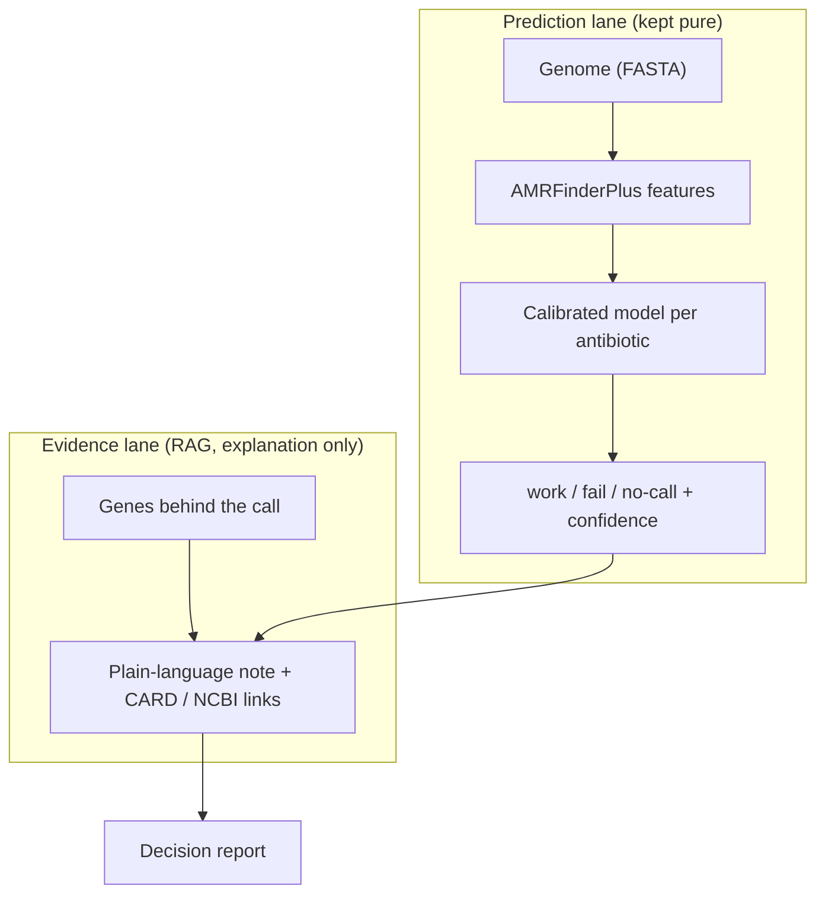

# 🧬 Genome Firewall

**A defensive AI decision-support tool that predicts which antibiotics are likely to fail for a bacterial genome, before slow lab cultures return.**

Antibiotic-resistant infections are linked to more than 4.7 million deaths a year. When someone is septic, standard susceptibility testing takes one to three days, and every ineffective drug in that window costs the patient time and gives resistant bacteria another chance to spread. Genome Firewall reads a reconstructed bacterial genome and, for each antibiotic, returns **likely to work**, **likely to fail**, or **no-call**, with a calibrated confidence and the genes behind the call.

Built for the Hack-Nation 6th Global AI Hackathon, Challenge 06, powered by OpenAI.

> **Research prototype.** Decision support only. Every result must be confirmed by standard laboratory testing. This system predicts and explains resistance that already exists. It never designs, modifies, or optimises an organism.

---

## The core design idea: two lanes that never cross

The prediction comes from an interpretable model on the genome. Retrieved evidence only *explains* that prediction, it never changes it. This is what keeps confidence meaningful and explanations honest.



## The three modules

| Module | File | What it does |
|--------|------|--------------|
| 1. Genome Reader | `src/features.py` | FASTA to resistance gene / mutation features via AMRFinderPlus (with a precomputed fallback) |
| 2. Predictor | `src/model.py` | One calibrated logistic regression per antibiotic, plus a drug-target gate and a no-call rule |
| 3. Decision Report | `app.py` | Streamlit app with calibrated confidence, evidence category, evidence panel, and a mandatory lab-testing banner |

Supporting: `src/evidence.py` (evidence lane), `src/metrics.py` (honest scoring), `src/data_sim.py` (synthetic demo data), `train.py` (grouped-split training and evaluation).

## What makes the predictions trustworthy

- **Calibrated confidence.** Probabilities are calibrated on a held-out split and checked with Brier score and reliability curves, so a stated 80 percent really means 80 percent.
- **A no-call option.** The model abstains on weak or conflicting evidence rather than forcing a false yes/no.
- **A deterministic drug-target gate.** It never reports "likely to work" merely because resistance markers are absent, if the drug's molecular target is missing the organism is intrinsically non-susceptible.
- **Honest evidence categories.** Each call is labelled as resting on a known resistance gene, a statistical association, or no known signal. A statistical association is never dressed up as biological cause.
- **Grouped generalisation.** Whole lineages are held out for testing, so the model is scored on genetically distinct genomes and cannot inflate its score by memorising near-identical bacteria.

## Quick start

```bash
python -m venv .venv && source .venv/bin/activate   # Windows: .venv\Scripts\activate
pip install -r requirements.txt

python train.py          # train + evaluate on the grouped split, writes artifacts/
streamlit run app.py     # launch the demo
```

The app trains in memory the first time, so `streamlit run app.py` works even before `train.py`.

Set `OPENAI_API_KEY` (copy `.env.example` to `.env`) to enable OpenAI-written plain-language notes. Without it the app uses curated notes and still runs fully.

## Scope

One species (*Klebsiella pneumoniae* in this prototype) and a five-antibiotic panel, done well, with calibrated confidence and a no-call option. Everything before genome reconstruction (sampling, sequencing, assembly, species ID) is out of scope by design.

## Roadmap

- Wire in the real BV-BRC dataset (see `data/README.md`).
- Add sequence-homology de-duplication before the split.
- Optional genomic-language-model embeddings (HyenaDNA / DNABERT-2) as a stretch, only once the baseline is solid.

## Safety and responsibility

Strictly defensive, and scoped to predicting and explaining resistance that already exists in openly available genomes. It supports treatment choices and public-health tracking. It excludes all sample-to-genome processing and any design, synthesis, or enhancement of organisms. The decision report is support for a trained professional and must never make a treatment decision on its own.
